<div align="center">

# 🔑 AWS EC2 SSH Access with Windows (PuTTY vs PowerShell)

<p align="center">
  <a href="https://aws.amazon.com/ec2/">
    
  </a>
  <a href="https://ubuntu.com">
    
  </a>
  <a href="https://www.putty.org/">
    
  </a>
  <a href="https://daringfireball.net/projects/markdown/">
    
  </a>
</p>

</div>

---

<div align="center">

## 🔽 Download PuTTY

[](https://www.putty.org/)  

Atau langsung ke situs resminya 👉 [PuTTY Official Download Page](https://www.putty.org/)

</div>

---

<p align="center">
  
</p>


---

## 📌 Pendahuluan
Ketika meluncurkan **EC2 Instance di AWS**, Amazon memberikan **Key Pair** berupa file `.pem`. File ini adalah **private key** untuk login ke server.  

- Di **Linux/macOS**, login langsung dengan perintah `ssh`.  
- Di **Windows**, ada dua opsi:
  1. **PowerShell/WSL** → bisa langsung pakai `.pem`.  
  2. **PuTTY** → harus convert `.pem` → `.ppk` dengan **PuTTYgen**.  

---

## 🖥️ 1. Menggunakan PowerShell (lebih simpel)

### ✅ Langkah-langkah
1. Simpan file key pair dari AWS, misalnya `my-key.pem`.  
2. Buka **PowerShell** lalu jalankan:  

   ```powershell
   ssh -i "C:\Users\<username>\Downloads\my-key.pem" ubuntu@<Public-IP>
   ```


🔐 2. Menggunakan PuTTY (butuh konversi key)
✅ Peranan PuTTY
PuTTY = aplikasi SSH Client untuk Windows.
Dulu Windows belum ada SSH bawaan → jadi PuTTY jadi alat utama untuk remote server.

✅ Peranan PuTTYgen
PuTTY hanya bisa pakai key .ppk.
Maka .pem → harus dikonversi ke .ppk dulu dengan PuTTYgen.

✅ Langkah-langkah
Buka PuTTYgen → klik Load → pilih my-key.pem.

Klik Save private key → simpan sebagai my-key.ppk.

Buka PuTTY → masukkan:

Host Name: ubuntu@<Public-IP>

Port: 22

Auth: Browse ke file my-key.ppk.

Klik Open → login berhasil.

```mermaid
flowchart TD
    A[AWS Download .pem Key] --> B{Windows User}
    B -->|Pakai PowerShell| C[Gunakan .pem langsung via ssh]
    B -->|Pakai PuTTY| D[Convert .pem → .ppk dengan PuTTYgen]
    D --> E[Gunakan .ppk di PuTTY untuk login]
```



| Opsi           | Kelebihan                    | Kekurangan                    |
| -------------- | ---------------------------- | ----------------------------- |
| **PowerShell** | Mudah, langsung pakai `.pem` | Hanya jalan di Windows modern |
| **PuTTY**      | Bisa dipakai di Windows lama | Harus convert `.pem` → `.ppk` |


---

## 📚 Referensi

- [AWS EC2 Documentation](https://docs.aws.amazon.com/ec2/)
- [PuTTY Official Site](https://www.putty.org/)
- [Ubuntu Cloud](https://ubuntu.com/cloud)

---


<h3 align="center" style="color:#39ff14; font-size:1.5rem;">
💡 ☕ Traktir Kopi & Nasi Padang / Nasi Gorengnya ya cuy! 😄
</h3>

<div align="center">

<p style="color:#ffffff; font-size:1.1rem;">
Dukung terus biar semangat bikin karya edukatif lainnya...  
Keep supporting so I stay motivated to create more educational works!
</p>

<a href="https://www.paypal.com/paypalme/bungtempong99" target="_blank" style="text-decoration:none;">
  
</a>

<p style="color:#39ff14; font-size:1rem; margin-top:8px;">
Support with ☕ so I can buy 🍜 and keep being 🧠!
</p>

</div>

---

<h2 align="center" style="color:#39ff14;">📫 Let’s Connect together</h2>

<p align="center">
  <a href="https://github.com/kongali1720" target="_blank">
    
  </a>
  <a href="mailto:admin@kongali1720.com">
    
  </a>
  <a href="https://discord.gg/dXM88zFU" target="_blank">
    
  </a>
  <a href="https://www.instagram.com/kongali1720/" target="_blank">
    
  </a>
</p>

<p align="center">
  <a href="https://x.com/Kongali1720" target="_blank">
    
  </a>
  <a href="https://younext.cloud" target="_blank">
    
  </a>
  <a href="https://kongali1720.com" target="_blank">
    
  </a>
  <a href="https://wa.me/447440014278" target="_blank">
    
  </a>
</p>


---

<h3 align="center" style="color:#ff69b4;">❤️ 💻 INITIATING HUMANITY MODE... for Down Syndrome ❤️</h3>

<div align="center">

<table style="margin: 0 auto; border-collapse: collapse; box-shadow: 0 4px 10px rgba(0,0,0,0.2); border-radius: 8px; overflow: hidden;">
  <thead style="background-color:#ff69b4; color:white;">
    <tr>
      <th style="padding: 12px 25px; font-size: 18px;">Item</th>
      <th style="padding: 12px 25px; font-size: 18px;">Keterangan / Description</th>
    </tr>
  </thead>
  <tbody style="background-color:#1a1a1a; color:#39ff14;">
    <tr>
      <td style="padding: 12px 25px;">🎯 Target</td>
      <td style="padding: 12px 25px;">Anak-anak Pejuang Down Syndrome / Kids with Down Syndrome</td>
    </tr>
    <tr>
      <td style="padding: 12px 25px;">📡 Status</td>
      <td style="padding: 12px 25px;">Butuh Dukungan / Needs Support</td>
    </tr>
    <tr>
      <td style="padding: 12px 25px;">🧠 Response</td>
      <td style="padding: 12px 25px;">Buka Hati + Klik Link = Satu Senyum Baru / Open Heart + Click Link = One New Smile</td>
    </tr>
  </tbody>
</table>

<p align="center" style="margin-top:15px; color:white; font-size:1rem;">
Mereka bukan berbeda — mereka dilahirkan untuk mengajarkan dunia tentang cinta yang murni dan kesabaran yang luar biasa.<br>
They are not different — they were born to teach the world pure love and extraordinary patience.
</p>

<p align="center" style="margin-top: 15px;">
  <a href="https://mydonation4ds.github.io/" target="_blank" style="display: inline-block; text-decoration:none;">
    
  </a>
</p>

---

<section align="center" style="font-family: Arial, sans-serif;">

<h2 style="margin-bottom: 15px; color: #0070f3;">💳 Dukungan Pembayaran</h2>

<table align="center" style="margin: 0 auto; border-collapse: collapse; border-radius: 8px; overflow: hidden;">
  <thead style="background-color: #0070f3; color: white;">
    <tr>
      <th style="padding: 10px 20px; font-size: 16px;">Visa</th>
      <th style="padding: 10px 20px; font-size: 16px;">Mastercard</th>
      <th style="padding: 10px 20px; font-size: 16px;">PayPal</th>
    </tr>
  </thead>
  <tbody style="background-color: #f9f9f9;">
    <tr>
      <td style="padding: 10px;">
        
      </td>
      <td style="padding: 10px;">
        
      </td>
      <td style="padding: 10px;">
        
      </td>
    </tr>
  </tbody>
</table>

</section>

---

<p align="center" style="margin-top: 15px;">
  Kalau project ini bantu kamu, jangan lupa kasih bintang ⭐ dan share ke teman-teman!<br>
  Follow <a href="https://x.com/KongAli50422468" target="_blank">@KongAli50422468</a> untuk diskusi & update seru 🔥
</p>

<p align="center" style="margin-top: 10px;">
  <a href="https://x.com/KongAli50422468" target="_blank">
  </a>
</p>


